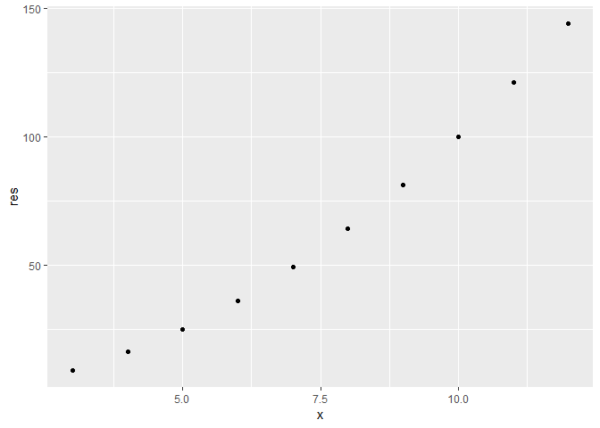

<!-- README.md is generated from README.Rmd. Please edit that file -->

[](https://travis-ci.org/vincenzocoia/powers)

**Note**: This R package is not mean to be “serious”. It’s just for
teaching purposes.

# powers

This is an R package that gives `sqrt()` friends by providing other
power functions.

## Installation

You can install powers from github with:

``` r
# install.packages("devtools")
devtools::install_github("STAT545-UBC-students/hw07-g-ziyan/tree/master/powers-master")
```

## Example

See the vignette for more extensive use, but here’s an example:

``` r
powers::box_cox_trans(1:10,2,2,plot_it=TRUE)
```

<!-- -->

    #>  [1]   8  15  24  35  48  63  80  99 120 143

## For Developers

(Again, I don’t actually intend for anyone to develop this silly
package, but if I did, here’s what I’d write.)

Use the internal `pow` function as the machinery for the front-end
functions such as `square`, `cube`, `reciprocal` and `box_cox_trans`.
